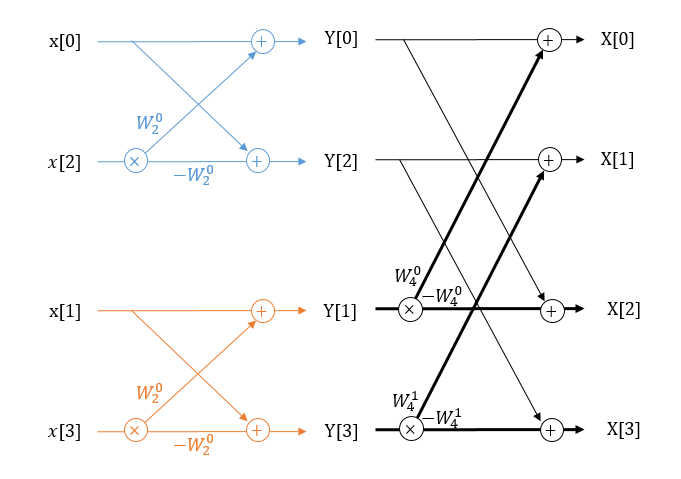

# Fast Fourier Transformation


This is my Radix-2 FFT library, which was first developped for an embedded system consisting of a Texas Instrument ARM Cortex-M0 with a 128x96 OLED display.
Since then, I've used it on in a homebrew for the PSVita made by Sony. You can find the source for the homebrew in my repositories.

It is based on the schematic representation of a Radix-2 FFT:


*source for image : https://hkn.illinois.edu/wiki/wiki:signal_processing:fft

## Dependencies:

* Only std includes used

The library should be cross-platform compatible.

## How to change number of FFT points

There are 3 defines that control the FFT. These have a default value you can see below.

If you want to change this, you'll have to define them in your Makefile or CMakeLists. With cmake, add the defines like so : "**add_definitions(-DFFT_POINT=1024)**"

```C
	/* DEFAULT VALUES */
	#ifndef FFT_POINT
		/* N */
		#define FFT_POINT 512
	#endif
	#ifndef FFT_POINT_2
		/* N/2 */
		#define FFT_POINT_2 256
	#endif
	#ifndef FFT_STAGES
		/* log(N)/log(2) */
		#define FFT_STAGES 9
	#endif
```

For a 1024 point FFT you have to set the defines to 1024, 512, 10, respectively.

**Note:** The library (and Radix-2 fft) has been made in such a way that the FFT point value is expected to be a value of 2^X. If you try a different value, it is highly likely that it will not work as intended and crash or not work at all.

## Library functions:

The functions are divided in two groups:

* Functions to execute before the main FFT loop and only once:

```C
	void fft_BlockPerStage(uint16_t *pblocks);
	void fft_ButterfliesPerBlocks(uint16_t *pbutterflies);
	void fft_BitReversedLUT(uint16_t *pbit_reversed);
	void fft_TwiddleFactor(Complex *pW);
	void fft_Window(uint8_t type, float *pWin);
```

* Functions to execute continuously before and after each FFT computation:

```C
	void fft_DataToComplex(float *px, float *pWin, Complex *pdata_complex, uint16_t *pbit_reversed);
	void fft_Compute(Complex *pdata_complex, Complex *pW, uint16_t *pblocks, uint16_t *pbutterflies);

	void fft_ComplexToMagnPhase(Complex *pdata_complex, FFT *pspectrum, uint8_t normalize);
	OR
	void fft_ComplexTodB(Complex *pdata_complex, FFT *pspectrum);	
```
## How to calculate the phase:

For this you'll have to uncomment a define in fft.h.

```C
/**************
 * Uncomment to calculate phase
 * #define FFT_PHASE_USE
 **************/
```

## Window function for the FFT

The library has 7 different windows that you can use on your samples:

```C
/* Types of window */
#define FFT_WIN_RECTANGLE 0
#define FFT_WIN_TRIANGLE 1
#define FFT_WIN_HANNING 2
#define FFT_WIN_HAMMING 3
#define FFT_WIN_BLACKMAN 4
#define FFT_WIN_NUTTALL 5
#define FFT_WIN_FLAT_TOP 6
```

Use this with the fft_Window() function.

This is to be used before your main loop, to initialize a float window array.

If you don't know what this is go to [this wikipedia page](https://en.wikipedia.org/wiki/Window_function) for more info.

## License

Creative Commons Attribution-ShareAlike 4.0 International, see LICENSE.md.
